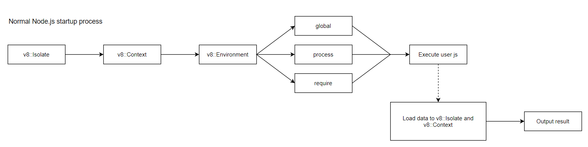
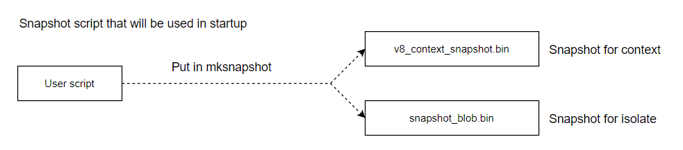
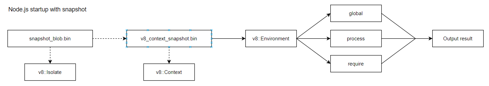

# Vấn đề cần giải quyết

Khi app mở rộng ngày càng nhiều với nhiều module cần được load vào hơn, dữ liệu cần được xử lí nhiều hơn thì việc cắt giảm đi các bước xử lí dữ liệu thừa mỗi khi khởi động app là cần thiết để app khởi động nhanh hơn; đặc biệt là những dữ liệu mang tính bất biến (các hằng, các hàm xử lý, những dữ liệu chỉ cần compile và chạy một lần ban đầu). Với các app dùng Node thông thường, những chi phí đó sẽ không bị cắt giảm do mỗi khi khởi động thì toàn bộ những dữ liệu đó đều phải được compile và xử lí (execute) lại gây tốn nhiều thời gian lãng phí.

# Hướng giải quyết - dùng snapshot thuần

Bằng cách áp dụng snapshot, ta có thể cắt giảm được chi phí về mặt thời gian bị lãng phí trong những tình huống kể trên. Dưới đây là sơ đồ về quy trình khi một app Node thông thường khởi động:



1. Gọi xuống C++, khởi tạo vùng nhớ isolate cho tiến trình đang chạy Node đó thông qua `v8::Isolate`.
2. Tạo vùng nhớ context cho main thread thông qua `v8::Context`.
3. Thiết lập môi trường bằng `v8::Environment`.
4. Khởi tạo các giá trị toàn cục `global`, `process`, `require` từ thiết lập môi trường trong `v8::Environment`.
5. Compile file JS entry mà user cần thực thi thành binary.
6. Chạy file JS entry và nạp các dữ liệu trong quá trình chạy vào `v8::Isolate` và `v8::Context`.
7. Hoàn tất quá trình khởi động.

Nhận xét: đối với cách khởi động thông thường như trên, nếu dữ liệu khi khởi động của chúng ta không thay đổi (ví dụ nội dung các hàm, những xử lý tính toán mang tính chất cố định không thay đổi kết quả, các hằng số) thì việc compile lại cũng như thực thi và load từng công việc và dữ liệu lặp đi lặp lại vào trong `v8::Isolate` và `v8::Context` ở mỗi lần khởi động sẽ gây ra lãng phí về mặt thời gian.

Còn đây là sơ đồ về quy trình tạo snapshot và áp dụng snapshot vào nhằm tăng tốc độ khởi động app.

Tạo snapshot:



1. File JS entry của user sẽ tổng hợp những dữ liệu có tính tái sử dụng và lặp đi lặp lại nhiều ở mỗi lần khởi động như vấn đề đã nêu ở mục nhận xét trên.
2. Đưa file này vào thư viện `electron-mksnapshot` để tạo 2 file snapshot binary là `v8_context_snapshot.bin` dùng cho vùng nhớ `v8::Context` và `snapshot_blob.bin` dùng cho vùng nhớ `v8::Isolate`.

Áp dụng snapshot vào khởi động app:



Bản chất của việc tạo snapshot thực chất là ta sẽ chạy qua JS entry script cần khởi động một lần, sau khi kết thúc quá trình chạy file, trước khi các dữ liệu bị hủy bởi hệ thống thu dọn thì ta sẽ tiến hành snapshot lại trạng thái của dữ liệu ngay lúc đó ở trong `v8::Isolate` và `v8::Context`. Lúc này do quá trình chạy script đã xong nên các kết quả tính toán cũng đã hoàn tất và đang lưu trong `v8::Isolate` hoặc `v8::Context` nên khi snapshot lại thì giá trị vẫn được "ghi nhận" lại. Đầu ra của việc tạo snapshot sẽ là 2 file binary chứa thông tin trạng thái dữ liệu trong `v8::Isolate` và `v8::Context`. Và sau khi snapshot thì mỗi lần khởi động app về sau ta chỉ cần dùng 2 file này để khởi tạo ra `v8::Isolate` và `v8::Context` với nội dung dữ liệu giống như trong lần chạy script được snapshot, do đó ta không cần phải compile JS entry script cũng như thực thi chạy code từ đầu tới cuối file thêm lần nào nữa mà lúc này toàn bộ dữ liệu đều đã có sẵn từ lần snapshot và do đó giảm chi phí khởi động app nhiều lần.

## Cách tạo snapshot bằng `electron-mksnapshot` và dùng trong ứng dụng `electron`

Để tạo được snapshot thuần theo cách thông thường trong Node rất phức tạp: ta sẽ phải tạo addon C++ và gọi module C++ từ Node, sau đó truyền vào đường dẫn file cần snapshot. Tiếp đến trong module C++ ta sẽ gọi hàm `v8::V8::CreateSnapshotDataBlob` và compile rồi thực thi. Tiếp đến ta sẽ dùng `v8::Isolate::CreateParams` để cấu hình Node nhằm khởi tạo `v8::Isolate` bằng cách nạp dữ liệu từ snapshot thay vì khởi tạo rỗng như thông thường.

Thay vì phải can thiệp quá sâu vào C++ và dễ gây ra các lỗi khó hiểu không mong muốn thì ta có thể nhờ sự trợ giúp từ thư viện đó là `electron-mksnapshot`. Thư viện này có input là file JS entry và sau khi tạo snapshot binary xong sẽ ghi ra output là 2 file `snapshot_blob.bin` và `v8_context_snapshot.bin`. Tiếp theo, để áp dụng vào ứng dụng `electron`, ta sẽ ghi đè 2 file cấu hình snapshot có sẵn của `electron`. Trong quá trình phát triển, ta sẽ thay thế 2 file snapshot có sẵn ở đường dẫn `node_modules/electron/dist`, còn trong quá trình release sản phẩm thì ta sẽ tạo snapshot trước, thay thế 2 file snapshot có sẵn trong thư mục chứ content app và đóng gói release.

## Vấn đề gặp phải

Khi tạo snapshot thuần túy sẽ gặp 3 vấn đề nghiêm trọng sau:

* Các giá trị được trả về thông qua các hàm như `Math.random`, `Date.now` sẽ luôn là giá trị cố định ngay tại thời điểm tạo snapshot. Lý do là vì khi ta snapshot thì các giá trị được trả về lúc đó bởi các hàm trên sẽ được lưu vào snapshot nên khi nạp vào trong `v8::Isolate` và `v8::Context` những lần sau thì vẫn là những giá trị đó không thay đổi.
* Không thể gọi tới các object toàn cục trong Node như `require`, `global`, `process`, cũng như gọi tới các API của Node. Lý do là vì khi tạo snapshot ta không thể snapshot được các object này do các object này chỉ được tạo trong quá trình runtime khi khởi động app và dữ liệu lưu trong các object này sẽ thay đổi dựa theo `v8::Environment` ở mỗi lần chạy Node nên ta không thể snapshot được.
* Không thể snapshot các dữ liệu được khởi tạo bên ngoài vùng nhớ heap của v8. Ví dụ khi tạo mảng với các kiểu như `UInt32Array`, `Float32Array` thì dữ liệu có thể được cấp phát nằm ngoài vùng nhớ heap của v8 nên không thể snapshot được.

Đối với vấn đề thứ 3 thì hiện tại ta vẫn chưa có cách giải quyết nhưng với vấn đề 1 và 2 thì ta có thể giải quyết bằng cách dùng thư viện `electron-link` được tạo bởi team Atom.

# Khắc phục vấn đề gặp phải trong snapshot thuần với `electron-link`

`electron-link` áp dụng cơ chế lazy load nhằm khắc phục điểm yếu không thể gọi tới các object toàn cục trong Node bằng việc thay thế cái module bên ngoài, các object toàn cục thành các hàm nhằm gọi ngay lúc runtime thay vì gọi trực tiếp.

Ví dụ đoạn code sẽ gây lỗi nếu áp dụng snapshot trực tiếp:

```js
// Code 1
const path = require('path');

module.exports = function() {
  return path.join('a', 'b', 'c');
}
```

Nếu ta áp dụng `electron-link` vào thì đoạn code trên sẽ được chuyển thành như sau:

```js
// Code 2
let path;
function get_path() {
  return path || path = require('path');
}

module.exports = function() {
  return get_path().join('a', 'b', 'c');
}
```

Giải thích: Với đoạn code 1, nếu ta snapshot xong thì khi sử dụng hàm được export sẽ ngay lập tức bị lỗi do `require` không được snapshot chung và sẽ lỗi ngay từ dòng đầu `require` module `path`. Với đoạn code 2, module `path` không được load bằng `require` ngay từ đầu mà chỉ được load nếu hàm được export được gọi. Nếu ta gọi hàm export ngay thì kết quả vẫn sẽ lỗi giống đoạn code 1, nhưng `electron-link` đã tích hợp sẵn vào 1 module chung với khi snapshot là `setGlobals`. Ngay đầu JS entry, ta chỉ cần gọi module `setGlobals` và gán vào đó giá trị là các object toàn cục `global`, `process`, `require` thì sau đó ta có thể dùng hàm được export do lúc đó hàm `setGlobals` sẽ set các giá trị đó vào trong dữ liệu snapshot đã được load trong `v8::Isolate` và `v8::Context`.

Nội dung của hàm `setGlobals` như sau:

```js
setGlobals: function (newGlobal, newProcess, newWindow, newDocument, newConsole, nodeRequire) {
  // Populate the global function trampoline with the real global functions defined on newGlobal.
  globalFunctionTrampoline = newGlobal;

  for (let key of Object.keys(global)) {
    newGlobal[key] = global[key];
  }
  global = newGlobal;

  for (let key of Object.keys(process)) {
    newProcess[key] = process[key];
  }
  process = newProcess;

  for (let key of Object.keys(window)) {
    newWindow[key] = window[key];
  }
  window = newWindow;

  for (let key of Object.keys(document)) {
    newDocument[key] = document[key];
  }
  document = newDocument;

  for (let key of Object.keys(console)) {
    newConsole[key] = console[key];
  }
  console = newConsole;

  require = nodeRequire;
}
```

Khi gọi hàm đó và truyền vào các giá trị `global`, `process`, `console`, `require` thì ta có thể dùng được những giá trị đó chung với dữ liệu được snapshot đã load vào.

# Test hiệu năng và thông số

## JS thuần - vanila JS

|             | 1       | 2       | 3       | 4       | 5       | 6       | 7       | 8       | 9       | 10      | Avg     |
|-------------|---------|---------|---------|---------|---------|---------|---------|---------|---------|---------|---------|
| Snapshot    | 262.047 | 266.171 | 264.637 | 262.145 | 263.338 | 262.668 | 264.603 | 261.204 | 269.651 | 267.720 | 264.418 |
| No snapshot | 271.947 | 276.323 | 266.788 | 271.422 | 276.040 | 265.221 | 267.907 | 265.542 | 271.375 | 268.500 | 270.107 |

Với bài test cho JS thuần thì việc dùng snapshot sẽ nhanh hơn không dùng snapshot là 5.689 ms.

## Stress test

|             | 1        | 2        | 3        | 4        | 5        | 6        | 7        | 8        | 9        | 10       | Avg      |
|-------------|----------|----------|----------|----------|----------|----------|----------|----------|----------|----------|----------|
| Snapshot    | 222.131  | 180.656  | 181.454  | 179.521  | 181.481  | 179.494  | 189.363  | 182.275  | 179.631  | 194.376  | 187.038  |
| No snapshot | 1291.641 | 1289.596 | 1296.994 | 1292.161 | 1294.344 | 2085.127 | 2094.755 | 2090.167 | 2128.768 | 2084.630 | 1694.818 |

Khi thực hiện stress test nặng, nếu app không dùng snapshot và khởi động tốn trung bình 1.7 s thì khi dùng snapshot sẽ rút ngắn rất nhiều chỉ còn trung bình 187 ms.

## Giải thích

Bằng việc sử dụng snapshot, ta chỉ việc chạy script 1 lần, sau đó đưa toàn bộ dữ liệu được snapshot vào blob thế nên ta rút ngắn được rất nhiều chi phí cho việc chạy script đó.

# Đánh giá

## Ưu điểm

* Với snapshot ta có thể tăng tốc thời gian khởi động app đi rất nhiều thông qua các số liệu đã nêu trên.
* Với `electron-link` ta có thể mở rộng khả năng của snapshot thông thường, cho phép load thêm vào các object toàn cục cũng như áp dụng lazy load cho các module nhằm giảm thêm thời gian khởi động app trong một số trường hợp.

## Nhược điểm

* Chỉ có thể tạo và nạp được 1 snapshot khi khởi động app.
* Thời gian khởi tạo cho môi trường `v8::Isolate` và `v8::Context` sẽ tăng do phải nạp dữ liệu từ snapshot vào. Tuy nhiên do hai môi trường này được gọi từ C++ native nên nhanh hơn rất nhiều nếu so với việc phải compile JS code và thực thi.
* Dữ liệu cấp phát ban đầu (nếu không xét các module không thuộc JS thuần) trước khi khởi động hoàn tất có thể tăng lên do nếu dùng snapshot ta phải nạp toàn bộ dữ liệu từ snapshot vào `v8::Context` và `v8::Isolate` ban đầu khi khởi tạo; còn nếu không dùng thì chỉ khi chạy JS script thì dữ liệu mới được khởi tạo. Tuy nhiên, nếu xét về khía cạnh sau khi đã khởi động hoàn tất thì dữ liệu khi có và không có snapshot đều tương đồng nhau.

# Hướng phát triển

Snapshot có thể áp dụng tốt với electron từ main process và renderer process. Cả main process và renderer process đều có thể truy cập và sử dụng vào snapshot đã tạo sẵn. Cache cho các module trong main process và giữa các renderer process là khác nhau, do đó nếu các process này cùng sử dụng chung 1 data từ module JS nào đó thì có bao nhiêu process gọi đến sẽ là có bấy nhiêu lần module JS đó được resolve, compile và load. Nếu module JS đó có thể được snapshot thì ta sẽ có thể loại bỏ được toàn bộ chi phí hao tốn do require ở từng process.

Ở main process: nếu áp dụng được snapshot thì sẽ giảm thời gian khởi động app và main process không bị block.
Ở renderer process: sử dụng snapshot sẽ giúp cho nội dung UI hiển thị nhanh hơn.

## Test renderer process - Thời gian UI load hoàn tất

|             | 1      | 2      | 3      | 4      | 5      | 6      | 7      | 8      | 9      | 10     | Avg    |
|-------------|--------|--------|--------|--------|--------|--------|--------|--------|--------|--------|--------|
| Snapshot    | 177    | 192    | 169    | 182    | 173    | 172    | 175    | 175    | 192    | 170    | 177.7  |
| No snapshot | 1284   | 1273   | 1282   | 1291   | 1295   | 1286   | 1298   | 1359   | 1324   | 1279   | 1297.1 |

# Tài liệu tham khảo

* https://v8.dev/blog/custom-startup-snapshots
* https://docs.google.com/document/d/1YEIBdH7ocJfm6PWISKw03szNAgnstA2B3e8PZr_-Gp4/edit#heading=h.yu2x6maip4of
* https://github.com/atom/atom/blob/master/script/lib/generate-startup-snapshot.js
* https://blog.atom.io/2017/04/18/improving-startup-time.html
* http://peterforgacs.github.io/2018/09/12/How-to-create-a-V8-snapshot-of-your-javascript-file/
* https://dev.to/aafrey/eli5-v8-isolates-and-contexts-1o5i